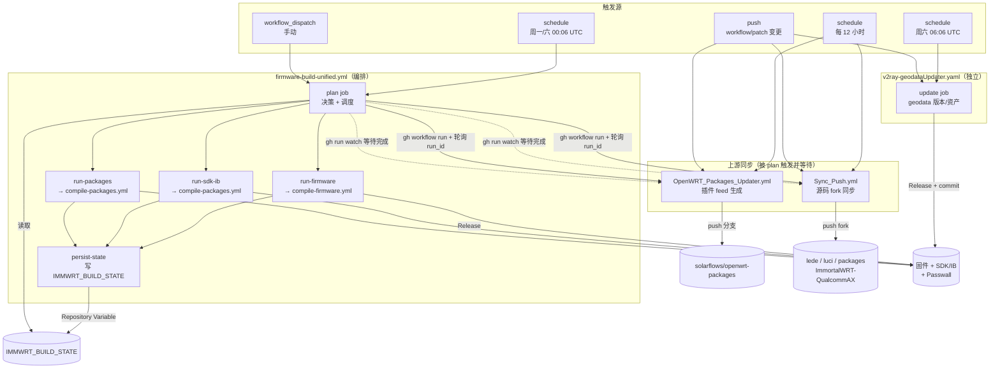
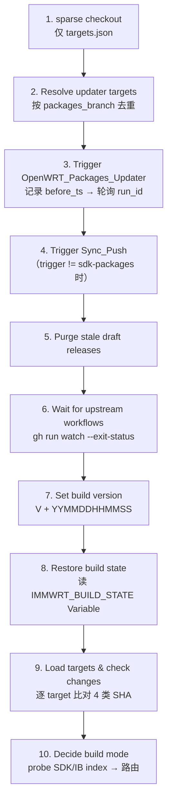
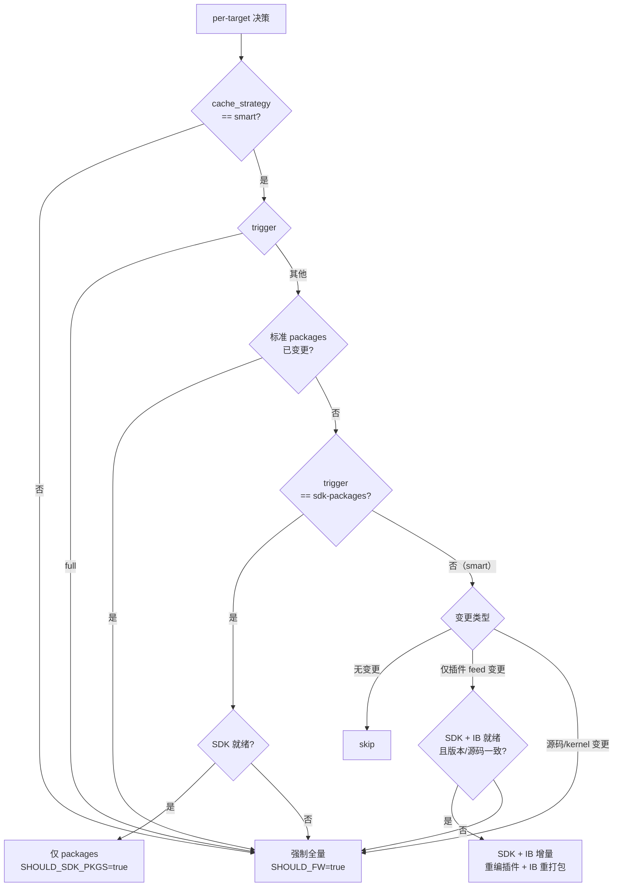
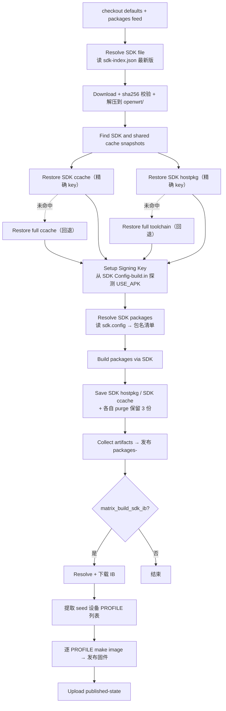
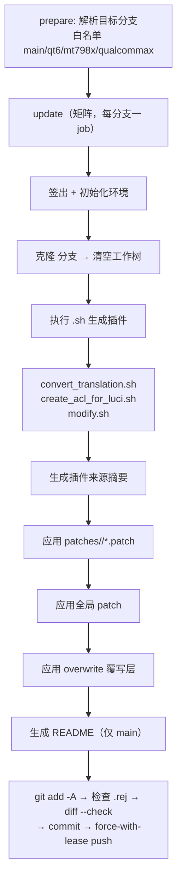
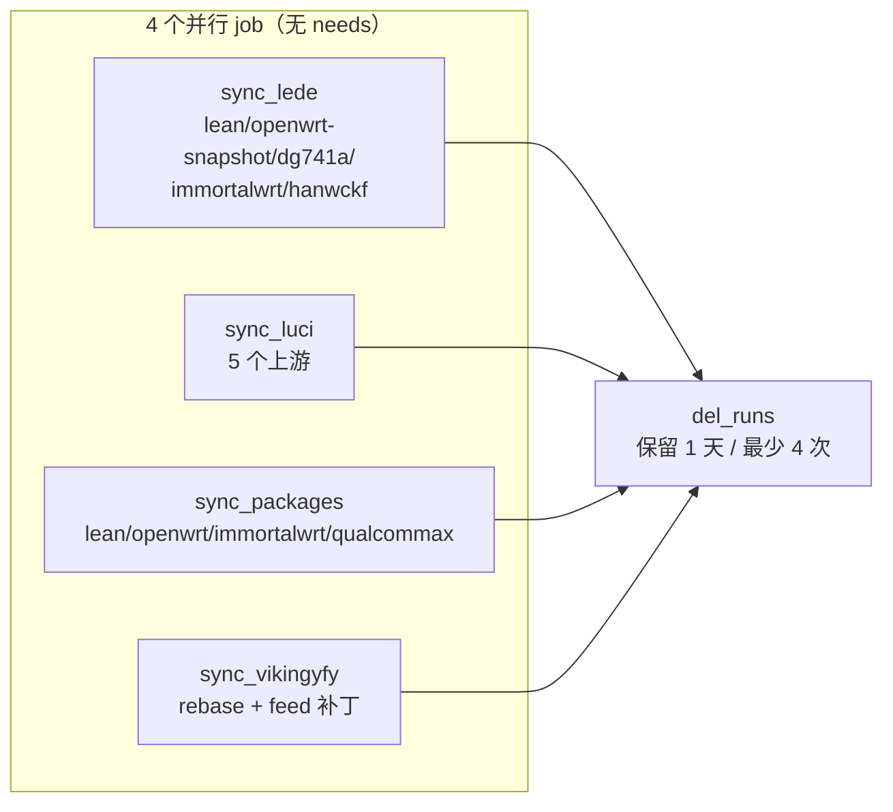
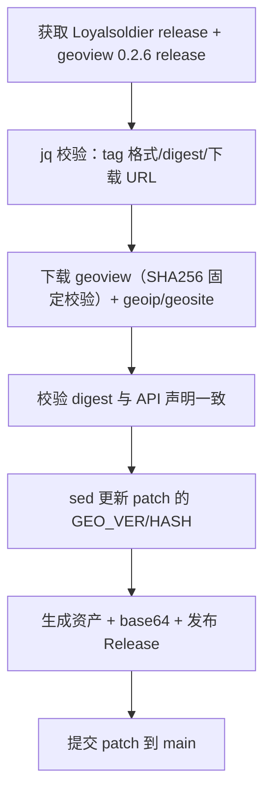
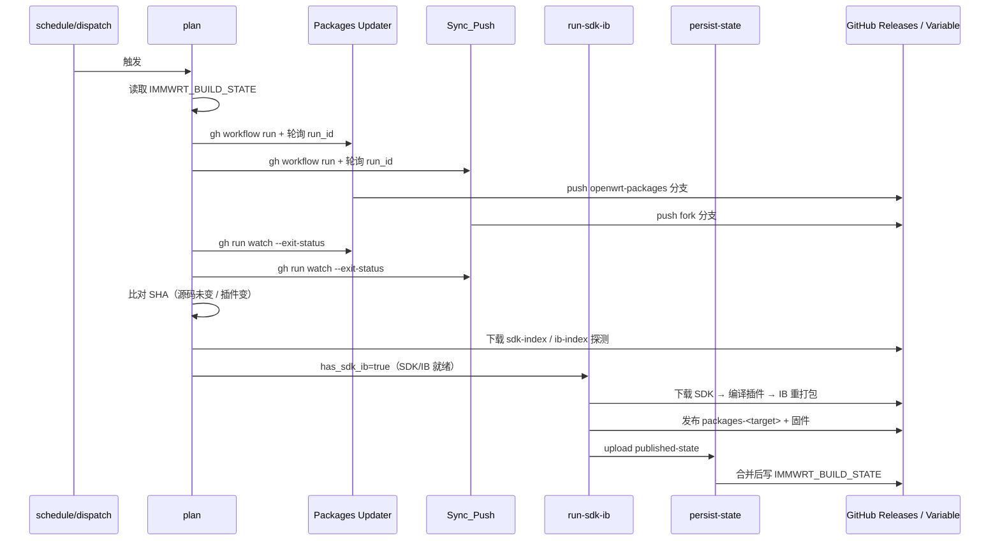

# AutoWorkflows CI 运行流程总览

> 生成日期：2026-09-09
> 范围：`.github/workflows/` 下 6 个活跃工作流（`archive/` 仅历史参考）
> 目标矩阵：`mt798x` / `ipq60xx` / `ipq807x`

---

## 1. 全局拓扑

---

## 2. 编排器：`firmware-build-unified.yml`

### 2.1 触发与并发

| 项 | 值 |
|---|---|
| `workflow_dispatch` | `target`（mt798x / ipq60xx / ipq807x / both）、`trigger`（smart / full / sdk-packages）、`cache_strategy`、`skip_upstream`、`free_disk_space` |
| `schedule` | `6 0 * * 1,6`（周一、周六 00:06 UTC） |
| 并发组 | `firmware-build-v2`（固定，**全仓库串行**，`cancel-in-progress: false`） |
| 权限 | `actions: write`、`contents: write` |

### 2.2 plan job（timeout 30min）

**步骤 9 的变更检测（per-target，互不短路）**

| 检测项 | 来源 | 含义 |
|---|---|---|
| `source_sha` | `git ls-remote <repo> <ref>` | 源码分支 HEAD |
| `packages_sha` | `git ls-remote <feed_repo> <packages_branch>` | 插件 feed HEAD |
| `standard_packages_sha` | `git ls-remote <std_repo> <std_branch>` | 标准 packages feed HEAD |
| `kernel_changed` | compare API → 本地浅克隆 diff 兜底 | 命中 `target/linux`、`toolchain`、`config/`、`include/`、`rules.mk`、`make.mk`、`package/kernel/` |

变更范围检测的降级链：**compare API → 本地 `git diff` → 保守视为 kernel 变更（走全量）**。

**步骤 10 的路由决策树**

**SDK/IB 就绪探测（`probe_index`）**：下载 `sdk-index.json` / `ib-index.json`，取 `built_at` 最新且 `file`/`sha256`/`source_sha` 齐全的记录，再校验对应资产与 `.sha256` 在 Release 中真实存在；仅插件变更时还要求 SDK 与 IB 的 `key` 与 `source_sha` 一致，否则升级全量。

### 2.3 矩阵与执行

| job | 复用工作流 | 条件 | 并发组 | timeout |
|---|---|---|---|---|
| `run-firmware` | `compile-firmware.yml` | `has_firmware == 'true'` | `compile-fw-<target>-<version>` | 480 |
| `run-sdk-ib` | `compile-packages.yml`（`matrix_build_sdk_ib=true`） | `has_sdk_ib == 'true'` | `repack-ib-<target>-<version>` | 240 |
| `run-packages` | `compile-packages.yml` | `has_packages == 'true'` | `compile-pkgs-<target>-<version>` | 240 |

三个 job 均 `fail-fast: false`，各 target 独立成败。

### 2.4 persist-state job（timeout 10min）

`needs: [plan, run-firmware, run-sdk-ib, run-packages]` + `always() && !cancelled()`，仅合并**已成功发布**的 target：

1. `download-artifact` 抓 `*-published-state`（**刻意不加 `merge-multiple`**，避免同名 `build-info.json` 互相覆盖）
2. `find` 遍历各 artifact 子目录，按 `target` 合并 `source_sha` / `packages_sha` / `standard_packages_*` / `last_build` / `last_mode`
3. 用 PAT 写回 `IMMWRT_BUILD_STATE` Repository Variable（`GITHUB_TOKEN` 无此权限）

---

## 3. 全量编译：`compile-firmware.yml`

```mermaid
flowchart TD
    A["checkout defaults + source<br/>改写 feeds.conf.default"] --> B["💽 磁盘阶段①"]
    B --> C["Compute toolchain hash<br/>tools/toolchain tree sha256[:16]"]
    C --> D["Prepare Environment<br/>apt + ImmortalWrt 初始化脚本<br/>（均有 timeout）"]
    D --> E["💽 磁盘阶段②"]
    E --> F["Find exact cache snapshots<br/>gh cache list + 锚定正则"]
    F --> G["Restore toolchain / ccache<br/>（按 cache_strategy 分支）"]
    G --> H["Update Feeds & Packages"]
    H --> I["Apply Configuration<br/>合并 seed → defconfig → 版本解析 → 签名探测"]
    I --> J["Setup Signing Key<br/>APK(PEM) / usign(Ed25519)"]
    J --> K["📥 make download"]
    K --> L["💽 磁盘阶段③"]
    L --> M["🔧 Prepare toolchain & ccache<br/>先 tools/ccache/compile 再 tools+toolchain"]
    M --> N["🔨 Build Firmware<br/>make -j(nproc+1) -k"]
    N --> O{"make_exit == 0?"}
    O -->|"否"| P["🔁 Retry build<br/>git pull → logs→logs.1 → -j → -j1 V=sc"]
    O -->|"是"| Q
    P --> Q["💽 磁盘阶段④ + 总耗时"]
    Q --> R["📊 Build Log Analysis / 📈 ccache Stats"]
    R --> S["Save toolchain / ccache / SDK-hostpkg"]
    S --> T["Purge stale（各自独立，排除当前 key）"]
    T --> U["📦 打包 release/{firmware,passwall}"]
    U --> V["Publish firmware / Passwall"]
    V --> W["📦 Package SDK & IB → artifacts-<target>"]
    W --> X["Upload published-state"]
```

### 3.1 缓存策略矩阵

| 策略 | toolchain restore | ccache restore | save | purge | 路由 |
|---|:--:|:--:|:--:|:--:|---|
| `smart` | ✅ | ✅ | ✅ | ✅ | 正常决策 |
| `clean-toolchain` | ❌ | ✅ | ✅ | ✅ | 强制全量 |
| `clean-ccache` | ✅ | ❌ | ✅ | ✅ | 强制全量 |
| `clean-all` | ❌ | ❌ | ✅ | ✅ | 强制全量 |
| `no-cache` | ❌ | ❌ | ❌ | ❌ | 强制全量 |

- `clean-toolchain`/`clean-all` 时 toolchain hash 加 `force-<hash>-<run_id>` 后缀，保证写入新 key。
- `no-cache` 仍允许构建内 ccache（由 seed 的 `CONFIG_CCACHE` 控制），仅跳过 Actions Cache 持久化。

### 3.2 缓存命名空间（`immwrt-v2-*`）

| key 形态 | 生产者 | 消费者 | 保留策略 |
|---|---|---|---|
| `immwrt-v2-toolchain-<target>-<hash>` | full | full / SDK 回退 | 仅最新（purge 其余） |
| `immwrt-v2-ccache-<target>-<run_id>` | full | full / SDK 回退 | 仅最新 |
| `immwrt-v2-sdk-hostpkg-<target>-<run_id>` | full + SDK | SDK | SDK 保留 3 份 |
| `immwrt-v2-sdk-ccache-<target>-<run_id>` | SDK | SDK | SDK 保留 3 份 |

> 锚定正则（`^immwrt-v2-toolchain-<target>-(...)$`）确保 `ipq60xx` 与 `ipq807x` 前缀互不串扰；`gh cache list --key` 的前缀语义靠正则收口。

### 3.3 失败诊断链

| 证据源 | 用途 |
|---|---|
| `logs/*/error.txt` | **权威**失败包来源（`ERROR: <pkg> failed to build.`） |
| `logs.1/<pkg>/compile.txt` | 初次并行轮完整日志（重试前 `mv logs logs.1`） |
| `logs/<pkg>/compile.txt` | 重试轮日志（`-j1 V=sc` 完整 configure/编译命令） |
| `build.1.log` / `build.log` | 两轮 make 主日志 |
| `toolchain-prebuild.log` | 工具链预编译失败定位 |
| artifact `<target>-build-log` | 上述全部 + `.config`，保留 7 天 |

> `compile.txt` 末行 `time:` **不能**判定失败（`scripts/time.pl` 无论成败都打印），仅作为日志被中断（OOM）的兜底信号。

---

## 4. 增量路径：`compile-packages.yml`

**关键设计**：

- SDK 解压到 `openwrt/`（与全量同构），使 `rules.mk` 原生导出的 `CCACHE_DIR=$(TOPDIR)/.ccache` 在两套工作流指向同一路径。
- SDK 独占自己的 hostpkg / ccache 命名空间，**绝不写入或清理** full 的 `immwrt-v2-ccache-*`。
- IB 必须逐设备传 `PROFILE`（不传时 `USER_PROFILE ?= $(firstword $(PROFILE_NAMES))` 只构建首个设备）。

---

## 5. 上游同步工作流

### 5.1 `OpenWRT_Packages_Updater.yml`

- 并发组：`openwrt-packages-updater-<target>`（每分支独立，互不阻塞）。
- 推送使用 askpass + `--force-with-lease=<ref>:<expected>`，远端变化时**拒绝覆盖**。
- `git diff --cached --check` 的 trailing whitespace 只 warning，Git 执行错误才硬失败。

### 5.2 `Sync_Push.yml`

- 并发组：`同步并推送-shared`（同一工作流内串行，防 push 冲突）。
- `sync_vikingyfy`：`git fetch upstream main` → `merge-base --is-ancestor` 判断更新 → `rebase` → 应用 `qualcommax/0001-use-solarflows-packages-feed.patch` → 推送。
- `del_runs` 依赖 4 个同步 job（含失败也执行）。

### 5.3 `v2ray-geodataUpdater.yaml`

- 并发组：`v2ray-geodata-updater`。
- geoview 版本与 SHA256 **硬编码**在 `env`，保证可复现。

---

## 6. 端到端时序（smart 模式，仅插件变更）

---

## 7. 审查发现

### 7.1 契约与一致性（通过）

| 检查项 | 结果 |
|---|---|
| YAML 解析（6 个工作流） | ✅ |
| `run:` 块 `bash -n`（96 块） | ✅ |
| reusable inputs/secrets 与调用方一致 | ✅ |
| target 与种子目录一一对应 | ✅ |
| 缓存前缀互不包含（防串扰） | ✅ |
| 发布 tag 唯一（fw/passwall/artifacts） | ✅ |
| 禁用变量 `TARGET`/`HOST`/`BUILD` 未导出 | ✅ |
| `git diff --check` | ✅ |

### 7.2 观察到的风险点（建议关注，本次未修改）

| 优先级 | 位置 | 问题 | 影响 |
|---|---|---|---|
| 中 | `OpenWRT_Packages_Updater.yml` `prepare`/`update` | 无 `timeout-minutes` | 卡死时占用 runner 至默认 6h |
| 中 | `Sync_Push.yml` 5 个 job | 无 `timeout-minutes` | 同上 |
| 中 | `v2ray-geodataUpdater.yaml` `update` | 无 `timeout-minutes` | 同上 |
| 低 | `firmware-build-unified.yml` | `HAS_KERNEL` 变量被赋值但未参与路由（决策实际只看 `source_changed`，kernel 变更已包含在 source 变更内） | 无害的冗余，易误读 |
| 低 | `firmware-build-unified.yml` | `PUB_FW`/`PUB_PKGS` 仅用于 summary 文案，实际发布由 executor 内 `if: success()` 控制 | 语义重复，非缺陷 |
| 低 | `compile-firmware.yml` | `publish_sdk_ib` 输入由调用方传 `true`，但 unified 未显式传值，依赖默认值 | 契约隐式，建议显式 |
| 低 | `compile-packages.yml` | 无 `matrix_artifacts_keep_versions` 输入，SDK/IB 保留数只在 full 侧生效 | 设计如此（SDK 不发布 artifacts） |

### 7.3 已知的刻意为之处（勿误改）

- `merge-multiple: true` **不可加**到 persist-state 的 download-artifact。
- `compile.txt` 末行 `time:` 不能作为失败判据。
- `TARGET`/`HOST`/`BUILD` 不得出现在 workflow env / export。
- `concurrency: firmware-build-v2` 不得加 ref 作用域。
- ccache 不设 `compiler_check`，不强制压缩。
- `logs/` 重试前必须 `mv` 成 `logs.1/`，不得删除。
